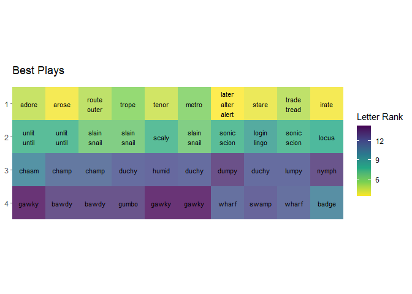

Wordle Stats
================

#### Data from the NYT

The word list comes from
[this](%22https://www.nytimes.com/games/wordle/main.18637ca1.js%22) JS
file. Look for `var Ma=` to see the list. You can see the full code
[here](https://github.com/rjake/one-off-projects/blob/main/R/wordle/input/download-data.R)

``` r
library(tidyverse)
library(glue)
library(gt)
library(scales)
library(simplecolors)

# read in NYT data
raw_words <-
  read_csv("input/nyt_word_list.csv") |>
  as_tibble() |> 
  print()
```

    # A tibble: 2,309 x 1
      word 
      <chr>
    1 cigar
    2 rebut
    3 sissy
    4 humph
    5 awake
    # ... with 2,304 more rows

``` r
# Break out each letter into its own column
word_letters <-
  raw_words |>
  separate(
    col = word,
    sep = "",
    into = paste0("x", 0:5),
    remove = FALSE
  ) |>
  select(-x0) |>
  print()
```

    # A tibble: 2,309 x 6
      word  x1    x2    x3    x4    x5   
      <chr> <chr> <chr> <chr> <chr> <chr>
    1 cigar c     i     g     a     r    
    2 rebut r     e     b     u     t    
    3 sissy s     i     s     s     y    
    4 humph h     u     m     p     h    
    5 awake a     w     a     k     e    
    # ... with 2,304 more rows

``` r
# Pivot the data to long-form and tally up frequencies
word_letters_long <- 
  word_letters |> 
  pivot_longer(
    cols = starts_with("x"),
    names_to = "position",
    values_to = "letter"
  ) |> 
   # times letter was used at all 
  add_count(letter, name = "letter_freq") |> 
  # times letter was used in position 
  add_count(letter, position, name = "position_freq") |> 
  print()
```

    # A tibble: 11,545 x 5
      word  position letter letter_freq position_freq
      <chr> <chr>    <chr>        <int>         <int>
    1 cigar x1       c              475           198
    2 cigar x2       i              670           201
    3 cigar x3       g              310            67
    4 cigar x4       a              975           162
    5 cigar x5       r              897           212
    # ... with 11,540 more rows

``` r
# Pivot wider
word_letter_freq <-
  word_letters_long |> 
  select(word, pos = letter, position, freq = position_freq) |>
  pivot_wider(
    names_from = position,
    values_from = c(pos, freq)
  ) |>
  rename_all(str_remove_all, "pos_") |> 
  print()
```

    # A tibble: 2,309 x 11
      word  x1    x2    x3    x4    x5    freq_x1 freq_x2 freq_x3 freq_x4 freq_x5
      <chr> <chr> <chr> <chr> <chr> <chr>   <int>   <int>   <int>   <int>   <int>
    1 cigar c     i     g     a     r         198     201      67     162     212
    2 rebut r     e     b     u     t         105     241      56      82     253
    3 sissy s     i     s     s     y         365     201      80     171     364
    4 humph h     u     m     p     h          69     185      61      50     137
    5 awake a     w     a     k     e         140      44     306      55     422
    # ... with 2,304 more rows

``` r
# Letters by total count and frequency in positions 1:5
letter_stats <- 
  word_letters_long |> 
  distinct(letter, letter_freq, position, position_freq) |> 
  pivot_wider(
    names_from = position,
    values_from = position_freq,
    values_fill = 0
  ) |> 
  arrange(desc(letter_freq))
```

<div id="inewwbwaup" style="overflow-x:auto;overflow-y:auto;width:auto;height:300px;">
<style>html {
  font-family: -apple-system, BlinkMacSystemFont, 'Segoe UI', Roboto, Oxygen, Ubuntu, Cantarell, 'Helvetica Neue', 'Fira Sans', 'Droid Sans', Arial, sans-serif;
}

#inewwbwaup .gt_table {
  display: table;
  border-collapse: collapse;
  margin-left: auto;
  margin-right: auto;
  color: #333333;
  font-size: 16px;
  font-weight: normal;
  font-style: normal;
  background-color: #FFFFFF;
  width: auto;
  border-top-style: solid;
  border-top-width: 2px;
  border-top-color: #A8A8A8;
  border-right-style: none;
  border-right-width: 2px;
  border-right-color: #D3D3D3;
  border-bottom-style: solid;
  border-bottom-width: 2px;
  border-bottom-color: #A8A8A8;
  border-left-style: none;
  border-left-width: 2px;
  border-left-color: #D3D3D3;
}

#inewwbwaup .gt_heading {
  background-color: #FFFFFF;
  text-align: center;
  border-bottom-color: #FFFFFF;
  border-left-style: none;
  border-left-width: 1px;
  border-left-color: #D3D3D3;
  border-right-style: none;
  border-right-width: 1px;
  border-right-color: #D3D3D3;
}

#inewwbwaup .gt_title {
  color: #333333;
  font-size: 125%;
  font-weight: initial;
  padding-top: 4px;
  padding-bottom: 4px;
  border-bottom-color: #FFFFFF;
  border-bottom-width: 0;
}

#inewwbwaup .gt_subtitle {
  color: #333333;
  font-size: 85%;
  font-weight: initial;
  padding-top: 0;
  padding-bottom: 6px;
  border-top-color: #FFFFFF;
  border-top-width: 0;
}

#inewwbwaup .gt_bottom_border {
  border-bottom-style: solid;
  border-bottom-width: 2px;
  border-bottom-color: #D3D3D3;
}

#inewwbwaup .gt_col_headings {
  border-top-style: solid;
  border-top-width: 2px;
  border-top-color: #D3D3D3;
  border-bottom-style: solid;
  border-bottom-width: 2px;
  border-bottom-color: #D3D3D3;
  border-left-style: none;
  border-left-width: 1px;
  border-left-color: #D3D3D3;
  border-right-style: none;
  border-right-width: 1px;
  border-right-color: #D3D3D3;
}

#inewwbwaup .gt_col_heading {
  color: #333333;
  background-color: #FFFFFF;
  font-size: 100%;
  font-weight: normal;
  text-transform: inherit;
  border-left-style: none;
  border-left-width: 1px;
  border-left-color: #D3D3D3;
  border-right-style: none;
  border-right-width: 1px;
  border-right-color: #D3D3D3;
  vertical-align: bottom;
  padding-top: 5px;
  padding-bottom: 6px;
  padding-left: 5px;
  padding-right: 5px;
  overflow-x: hidden;
}

#inewwbwaup .gt_column_spanner_outer {
  color: #333333;
  background-color: #FFFFFF;
  font-size: 100%;
  font-weight: normal;
  text-transform: inherit;
  padding-top: 0;
  padding-bottom: 0;
  padding-left: 4px;
  padding-right: 4px;
}

#inewwbwaup .gt_column_spanner_outer:first-child {
  padding-left: 0;
}

#inewwbwaup .gt_column_spanner_outer:last-child {
  padding-right: 0;
}

#inewwbwaup .gt_column_spanner {
  border-bottom-style: solid;
  border-bottom-width: 2px;
  border-bottom-color: #D3D3D3;
  vertical-align: bottom;
  padding-top: 5px;
  padding-bottom: 5px;
  overflow-x: hidden;
  display: inline-block;
  width: 100%;
}

#inewwbwaup .gt_group_heading {
  padding: 8px;
  color: #333333;
  background-color: #FFFFFF;
  font-size: 100%;
  font-weight: initial;
  text-transform: inherit;
  border-top-style: solid;
  border-top-width: 2px;
  border-top-color: #D3D3D3;
  border-bottom-style: solid;
  border-bottom-width: 2px;
  border-bottom-color: #D3D3D3;
  border-left-style: none;
  border-left-width: 1px;
  border-left-color: #D3D3D3;
  border-right-style: none;
  border-right-width: 1px;
  border-right-color: #D3D3D3;
  vertical-align: middle;
}

#inewwbwaup .gt_empty_group_heading {
  padding: 0.5px;
  color: #333333;
  background-color: #FFFFFF;
  font-size: 100%;
  font-weight: initial;
  border-top-style: solid;
  border-top-width: 2px;
  border-top-color: #D3D3D3;
  border-bottom-style: solid;
  border-bottom-width: 2px;
  border-bottom-color: #D3D3D3;
  vertical-align: middle;
}

#inewwbwaup .gt_from_md > :first-child {
  margin-top: 0;
}

#inewwbwaup .gt_from_md > :last-child {
  margin-bottom: 0;
}

#inewwbwaup .gt_row {
  padding-top: 8px;
  padding-bottom: 8px;
  padding-left: 5px;
  padding-right: 5px;
  margin: 10px;
  border-top-style: solid;
  border-top-width: 1px;
  border-top-color: #D3D3D3;
  border-left-style: none;
  border-left-width: 1px;
  border-left-color: #D3D3D3;
  border-right-style: none;
  border-right-width: 1px;
  border-right-color: #D3D3D3;
  vertical-align: middle;
  overflow-x: hidden;
}

#inewwbwaup .gt_stub {
  color: #333333;
  background-color: #FFFFFF;
  font-size: 100%;
  font-weight: initial;
  text-transform: inherit;
  border-right-style: solid;
  border-right-width: 2px;
  border-right-color: #D3D3D3;
  padding-left: 12px;
}

#inewwbwaup .gt_summary_row {
  color: #333333;
  background-color: #FFFFFF;
  text-transform: inherit;
  padding-top: 8px;
  padding-bottom: 8px;
  padding-left: 5px;
  padding-right: 5px;
}

#inewwbwaup .gt_first_summary_row {
  padding-top: 8px;
  padding-bottom: 8px;
  padding-left: 5px;
  padding-right: 5px;
  border-top-style: solid;
  border-top-width: 2px;
  border-top-color: #D3D3D3;
}

#inewwbwaup .gt_grand_summary_row {
  color: #333333;
  background-color: #FFFFFF;
  text-transform: inherit;
  padding-top: 8px;
  padding-bottom: 8px;
  padding-left: 5px;
  padding-right: 5px;
}

#inewwbwaup .gt_first_grand_summary_row {
  padding-top: 8px;
  padding-bottom: 8px;
  padding-left: 5px;
  padding-right: 5px;
  border-top-style: double;
  border-top-width: 6px;
  border-top-color: #D3D3D3;
}

#inewwbwaup .gt_striped {
  background-color: rgba(128, 128, 128, 0.05);
}

#inewwbwaup .gt_table_body {
  border-top-style: solid;
  border-top-width: 2px;
  border-top-color: #D3D3D3;
  border-bottom-style: solid;
  border-bottom-width: 2px;
  border-bottom-color: #D3D3D3;
}

#inewwbwaup .gt_footnotes {
  color: #333333;
  background-color: #FFFFFF;
  border-bottom-style: none;
  border-bottom-width: 2px;
  border-bottom-color: #D3D3D3;
  border-left-style: none;
  border-left-width: 2px;
  border-left-color: #D3D3D3;
  border-right-style: none;
  border-right-width: 2px;
  border-right-color: #D3D3D3;
}

#inewwbwaup .gt_footnote {
  margin: 0px;
  font-size: 90%;
  padding: 4px;
}

#inewwbwaup .gt_sourcenotes {
  color: #333333;
  background-color: #FFFFFF;
  border-bottom-style: none;
  border-bottom-width: 2px;
  border-bottom-color: #D3D3D3;
  border-left-style: none;
  border-left-width: 2px;
  border-left-color: #D3D3D3;
  border-right-style: none;
  border-right-width: 2px;
  border-right-color: #D3D3D3;
}

#inewwbwaup .gt_sourcenote {
  font-size: 90%;
  padding: 4px;
}

#inewwbwaup .gt_left {
  text-align: left;
}

#inewwbwaup .gt_center {
  text-align: center;
}

#inewwbwaup .gt_right {
  text-align: right;
  font-variant-numeric: tabular-nums;
}

#inewwbwaup .gt_font_normal {
  font-weight: normal;
}

#inewwbwaup .gt_font_bold {
  font-weight: bold;
}

#inewwbwaup .gt_font_italic {
  font-style: italic;
}

#inewwbwaup .gt_super {
  font-size: 65%;
}

#inewwbwaup .gt_footnote_marks {
  font-style: italic;
  font-weight: normal;
  font-size: 65%;
}
</style>
<table class="gt_table">
  
  <thead class="gt_col_headings">
    <tr>
      <th class="gt_col_heading gt_columns_bottom_border gt_left" rowspan="1" colspan="1">letter</th>
      <th class="gt_col_heading gt_columns_bottom_border gt_right" rowspan="1" colspan="1"># words</th>
      <th class="gt_col_heading gt_columns_bottom_border gt_right" rowspan="1" colspan="1">1</th>
      <th class="gt_col_heading gt_columns_bottom_border gt_right" rowspan="1" colspan="1">2</th>
      <th class="gt_col_heading gt_columns_bottom_border gt_right" rowspan="1" colspan="1">3</th>
      <th class="gt_col_heading gt_columns_bottom_border gt_right" rowspan="1" colspan="1">4</th>
      <th class="gt_col_heading gt_columns_bottom_border gt_right" rowspan="1" colspan="1">5</th>
    </tr>
  </thead>
  <tbody class="gt_table_body">
    <tr><td class="gt_row gt_left">e</td>
<td class="gt_row gt_right" style="background-color: #5EC9C9; color: #000000;">1230</td>
<td class="gt_row gt_right" style="background-color: #E2F5F4; color: #000000;">72</td>
<td class="gt_row gt_right" style="background-color: #86D5D4; color: #000000;">241</td>
<td class="gt_row gt_right" style="background-color: #A9E0E0; color: #000000;">177</td>
<td class="gt_row gt_right" style="background-color: #5EC9C9; color: #000000;">318</td>
<td class="gt_row gt_right" style="background-color: #5EC9C9; color: #000000;">422</td></tr>
    <tr><td class="gt_row gt_left">a</td>
<td class="gt_row gt_right" style="background-color: #86D5D4; color: #000000;">975</td>
<td class="gt_row gt_right" style="background-color: #C7EBEA; color: #000000;">140</td>
<td class="gt_row gt_right" style="background-color: #5EC9C9; color: #000000;">304</td>
<td class="gt_row gt_right" style="background-color: #5EC9C9; color: #000000;">306</td>
<td class="gt_row gt_right" style="background-color: #B4E4E3; color: #000000;">162</td>
<td class="gt_row gt_right" style="background-color: #E9F7F7; color: #000000;">63</td></tr>
    <tr><td class="gt_row gt_left">r</td>
<td class="gt_row gt_right" style="background-color: #91D8D8; color: #000000;">897</td>
<td class="gt_row gt_right" style="background-color: #D5F0EF; color: #000000;">105</td>
<td class="gt_row gt_right" style="background-color: #76D0CF; color: #000000;">267</td>
<td class="gt_row gt_right" style="background-color: #B0E3E2; color: #000000;">163</td>
<td class="gt_row gt_right" style="background-color: #B9E6E5; color: #000000;">150</td>
<td class="gt_row gt_right" style="background-color: #B5E4E4; color: #000000;">212</td></tr>
    <tr><td class="gt_row gt_left">o</td>
<td class="gt_row gt_right" style="background-color: #A5DFDE; color: #000000;">753</td>
<td class="gt_row gt_right" style="background-color: #EFF9F9; color: #000000;">41</td>
<td class="gt_row gt_right" style="background-color: #6FCECD; color: #000000;">279</td>
<td class="gt_row gt_right" style="background-color: #85D4D4; color: #000000;">243</td>
<td class="gt_row gt_right" style="background-color: #C2E9E8; color: #000000;">132</td>
<td class="gt_row gt_right" style="background-color: #EBF8F7; color: #000000;">58</td></tr>
    <tr><td class="gt_row gt_left">t</td>
<td class="gt_row gt_right" style="background-color: #A8E0DF; color: #000000;">729</td>
<td class="gt_row gt_right" style="background-color: #C3E9E9; color: #000000;">149</td>
<td class="gt_row gt_right" style="background-color: #DBF2F1; color: #000000;">77</td>
<td class="gt_row gt_right" style="background-color: #CAECEB; color: #000000;">111</td>
<td class="gt_row gt_right" style="background-color: #BFE8E7; color: #000000;">139</td>
<td class="gt_row gt_right" style="background-color: #A5DFDE; color: #000000;">253</td></tr>
    <tr><td class="gt_row gt_left">l</td>
<td class="gt_row gt_right" style="background-color: #AAE0E0; color: #000000;">716</td>
<td class="gt_row gt_right" style="background-color: #DCF2F2; color: #000000;">87</td>
<td class="gt_row gt_right" style="background-color: #9CDCDB; color: #000000;">200</td>
<td class="gt_row gt_right" style="background-color: #CAECEB; color: #000000;">112</td>
<td class="gt_row gt_right" style="background-color: #B4E4E3; color: #000000;">162</td>
<td class="gt_row gt_right" style="background-color: #C9EBEB; color: #000000;">155</td></tr>
    <tr><td class="gt_row gt_left">i</td>
<td class="gt_row gt_right" style="background-color: #B0E2E2; color: #000000;">670</td>
<td class="gt_row gt_right" style="background-color: #F2FAFA; color: #000000;">34</td>
<td class="gt_row gt_right" style="background-color: #9CDCDB; color: #000000;">201</td>
<td class="gt_row gt_right" style="background-color: #78D0D0; color: #000000;">266</td>
<td class="gt_row gt_right" style="background-color: #B6E5E4; color: #000000;">158</td>
<td class="gt_row gt_right" style="background-color: #FBFEFE; color: #000000;">11</td></tr>
    <tr><td class="gt_row gt_left">s</td>
<td class="gt_row gt_right" style="background-color: #B0E3E2; color: #000000;">668</td>
<td class="gt_row gt_right" style="background-color: #5EC9C9; color: #000000;">365</td>
<td class="gt_row gt_right" style="background-color: #F8FDFC; color: #000000;">16</td>
<td class="gt_row gt_right" style="background-color: #D9F1F1; color: #000000;">80</td>
<td class="gt_row gt_right" style="background-color: #AFE2E2; color: #000000;">171</td>
<td class="gt_row gt_right" style="background-color: #F3FAFA; color: #000000;">36</td></tr>
    <tr><td class="gt_row gt_left">n</td>
<td class="gt_row gt_right" style="background-color: #BCE7E6; color: #000000;">573</td>
<td class="gt_row gt_right" style="background-color: #F0FAF9; color: #000000;">37</td>
<td class="gt_row gt_right" style="background-color: #D6F0F0; color: #000000;">87</td>
<td class="gt_row gt_right" style="background-color: #BDE7E7; color: #000000;">137</td>
<td class="gt_row gt_right" style="background-color: #AAE0E0; color: #000000;">182</td>
<td class="gt_row gt_right" style="background-color: #D2EFEE; color: #000000;">130</td></tr>
    <tr><td class="gt_row gt_left">c</td>
<td class="gt_row gt_right" style="background-color: #C8EBEB; color: #000000;">475</td>
<td class="gt_row gt_right" style="background-color: #AEE2E1; color: #000000;">198</td>
<td class="gt_row gt_right" style="background-color: #EDF8F8; color: #000000;">40</td>
<td class="gt_row gt_right" style="background-color: #E5F5F5; color: #000000;">56</td>
<td class="gt_row gt_right" style="background-color: #B9E6E5; color: #000000;">150</td>
<td class="gt_row gt_right" style="background-color: #F4FBFB; color: #000000;">31</td></tr>
    <tr><td class="gt_row gt_left">u</td>
<td class="gt_row gt_right" style="background-color: #CAECEB; color: #000000;">466</td>
<td class="gt_row gt_right" style="background-color: #F2FAFA; color: #000000;">33</td>
<td class="gt_row gt_right" style="background-color: #A4DFDE; color: #000000;">185</td>
<td class="gt_row gt_right" style="background-color: #AFE2E2; color: #000000;">165</td>
<td class="gt_row gt_right" style="background-color: #D9F1F1; color: #000000;">82</td>
<td class="gt_row gt_right" style="background-color: #FFFFFF; color: #000000;">1</td></tr>
    <tr><td class="gt_row gt_left">y</td>
<td class="gt_row gt_right" style="background-color: #CFEDED; color: #000000;">424</td>
<td class="gt_row gt_right" style="background-color: #FDFEFE; color: #000000;">6</td>
<td class="gt_row gt_right" style="background-color: #F5FCFB; color: #000000;">22</td>
<td class="gt_row gt_right" style="background-color: #F2FAFA; color: #000000;">29</td>
<td class="gt_row gt_right" style="background-color: #FEFFFE; color: #000000;">3</td>
<td class="gt_row gt_right" style="background-color: #79D1D0; color: #000000;">364</td></tr>
    <tr><td class="gt_row gt_left">d</td>
<td class="gt_row gt_right" style="background-color: #D3EFEE; color: #000000;">393</td>
<td class="gt_row gt_right" style="background-color: #D3EFEE; color: #000000;">111</td>
<td class="gt_row gt_right" style="background-color: #F6FCFC; color: #000000;">20</td>
<td class="gt_row gt_right" style="background-color: #DCF2F2; color: #000000;">75</td>
<td class="gt_row gt_right" style="background-color: #DFF4F3; color: #000000;">69</td>
<td class="gt_row gt_right" style="background-color: #D6F0F0; color: #000000;">118</td></tr>
    <tr><td class="gt_row gt_left">h</td>
<td class="gt_row gt_right" style="background-color: #D3EFEF; color: #000000;">387</td>
<td class="gt_row gt_right" style="background-color: #E4F5F5; color: #000000;">69</td>
<td class="gt_row gt_right" style="background-color: #BAE6E5; color: #000000;">144</td>
<td class="gt_row gt_right" style="background-color: #FBFEFE; color: #000000;">9</td>
<td class="gt_row gt_right" style="background-color: #F2FAFA; color: #000000;">28</td>
<td class="gt_row gt_right" style="background-color: #D0EEED; color: #000000;">137</td></tr>
    <tr><td class="gt_row gt_left">p</td>
<td class="gt_row gt_right" style="background-color: #D6F0F0; color: #000000;">365</td>
<td class="gt_row gt_right" style="background-color: #C6EAEA; color: #000000;">141</td>
<td class="gt_row gt_right" style="background-color: #E3F5F4; color: #000000;">61</td>
<td class="gt_row gt_right" style="background-color: #E4F5F5; color: #000000;">57</td>
<td class="gt_row gt_right" style="background-color: #E8F7F6; color: #000000;">50</td>
<td class="gt_row gt_right" style="background-color: #ECF8F8; color: #000000;">56</td></tr>
    <tr><td class="gt_row gt_left">m</td>
<td class="gt_row gt_right" style="background-color: #DCF2F2; color: #000000;">316</td>
<td class="gt_row gt_right" style="background-color: #D4EFEF; color: #000000;">107</td>
<td class="gt_row gt_right" style="background-color: #EEF9F8; color: #000000;">38</td>
<td class="gt_row gt_right" style="background-color: #E2F5F4; color: #000000;">61</td>
<td class="gt_row gt_right" style="background-color: #E0F4F3; color: #000000;">68</td>
<td class="gt_row gt_right" style="background-color: #F1FAFA; color: #000000;">42</td></tr>
    <tr><td class="gt_row gt_left">g</td>
<td class="gt_row gt_right" style="background-color: #DDF3F2; color: #000000;">310</td>
<td class="gt_row gt_right" style="background-color: #D1EEEE; color: #000000;">115</td>
<td class="gt_row gt_right" style="background-color: #FBFDFD; color: #000000;">11</td>
<td class="gt_row gt_right" style="background-color: #E0F4F3; color: #000000;">67</td>
<td class="gt_row gt_right" style="background-color: #DCF2F2; color: #000000;">76</td>
<td class="gt_row gt_right" style="background-color: #F1FAFA; color: #000000;">41</td></tr>
    <tr><td class="gt_row gt_left">b</td>
<td class="gt_row gt_right" style="background-color: #E0F4F3; color: #000000;">280</td>
<td class="gt_row gt_right" style="background-color: #B9E6E5; color: #000000;">173</td>
<td class="gt_row gt_right" style="background-color: #F8FDFC; color: #000000;">16</td>
<td class="gt_row gt_right" style="background-color: #E5F5F5; color: #000000;">56</td>
<td class="gt_row gt_right" style="background-color: #F4FBFB; color: #000000;">24</td>
<td class="gt_row gt_right" style="background-color: #FBFEFE; color: #000000;">11</td></tr>
    <tr><td class="gt_row gt_left">f</td>
<td class="gt_row gt_right" style="background-color: #E7F6F6; color: #000000;">229</td>
<td class="gt_row gt_right" style="background-color: #C9EBEB; color: #000000;">135</td>
<td class="gt_row gt_right" style="background-color: #FCFEFE; color: #000000;">8</td>
<td class="gt_row gt_right" style="background-color: #F4FBFB; color: #000000;">25</td>
<td class="gt_row gt_right" style="background-color: #EFF9F9; color: #000000;">35</td>
<td class="gt_row gt_right" style="background-color: #F6FCFC; color: #000000;">26</td></tr>
    <tr><td class="gt_row gt_left">k</td>
<td class="gt_row gt_right" style="background-color: #E9F7F7; color: #000000;">210</td>
<td class="gt_row gt_right" style="background-color: #F7FCFC; color: #000000;">20</td>
<td class="gt_row gt_right" style="background-color: #FBFEFE; color: #000000;">10</td>
<td class="gt_row gt_right" style="background-color: #FAFDFD; color: #000000;">12</td>
<td class="gt_row gt_right" style="background-color: #E6F6F5; color: #000000;">55</td>
<td class="gt_row gt_right" style="background-color: #D8F1F0; color: #000000;">113</td></tr>
    <tr><td class="gt_row gt_left">w</td>
<td class="gt_row gt_right" style="background-color: #EBF8F7; color: #000000;">194</td>
<td class="gt_row gt_right" style="background-color: #DEF3F3; color: #000000;">82</td>
<td class="gt_row gt_right" style="background-color: #EBF8F7; color: #000000;">44</td>
<td class="gt_row gt_right" style="background-color: #F3FBFA; color: #000000;">26</td>
<td class="gt_row gt_right" style="background-color: #F4FBFB; color: #000000;">25</td>
<td class="gt_row gt_right" style="background-color: #F9FDFD; color: #000000;">17</td></tr>
    <tr><td class="gt_row gt_left">v</td>
<td class="gt_row gt_right" style="background-color: #F0FAF9; color: #000000;">152</td>
<td class="gt_row gt_right" style="background-color: #EEF9F9; color: #000000;">43</td>
<td class="gt_row gt_right" style="background-color: #F9FDFD; color: #000000;">15</td>
<td class="gt_row gt_right" style="background-color: #E8F7F6; color: #000000;">49</td>
<td class="gt_row gt_right" style="background-color: #EAF8F7; color: #000000;">45</td>
<td class="gt_row gt_right" style="background-color: #FFFFFF; color: #000000;">0</td></tr>
    <tr><td class="gt_row gt_left">z</td>
<td class="gt_row gt_right" style="background-color: #FDFEFE; color: #000000;">40</td>
<td class="gt_row gt_right" style="background-color: #FEFFFF; color: #000000;">3</td>
<td class="gt_row gt_right" style="background-color: #FFFFFF; color: #000000;">2</td>
<td class="gt_row gt_right" style="background-color: #FAFDFD; color: #000000;">11</td>
<td class="gt_row gt_right" style="background-color: #F6FCFC; color: #000000;">20</td>
<td class="gt_row gt_right" style="background-color: #FEFFFE; color: #000000;">4</td></tr>
    <tr><td class="gt_row gt_left">x</td>
<td class="gt_row gt_right" style="background-color: #FEFFFF; color: #000000;">37</td>
<td class="gt_row gt_right" style="background-color: #FFFFFF; color: #000000;">0</td>
<td class="gt_row gt_right" style="background-color: #F9FDFD; color: #000000;">14</td>
<td class="gt_row gt_right" style="background-color: #FAFDFD; color: #000000;">12</td>
<td class="gt_row gt_right" style="background-color: #FEFFFE; color: #000000;">3</td>
<td class="gt_row gt_right" style="background-color: #FCFEFE; color: #000000;">8</td></tr>
    <tr><td class="gt_row gt_left">q</td>
<td class="gt_row gt_right" style="background-color: #FFFFFF; color: #000000;">29</td>
<td class="gt_row gt_right" style="background-color: #F6FCFC; color: #000000;">23</td>
<td class="gt_row gt_right" style="background-color: #FEFEFE; color: #000000;">5</td>
<td class="gt_row gt_right" style="background-color: #FFFFFF; color: #000000;">1</td>
<td class="gt_row gt_right" style="background-color: #FFFFFF; color: #000000;">0</td>
<td class="gt_row gt_right" style="background-color: #FFFFFF; color: #000000;">0</td></tr>
    <tr><td class="gt_row gt_left">j</td>
<td class="gt_row gt_right" style="background-color: #FFFFFF; color: #000000;">27</td>
<td class="gt_row gt_right" style="background-color: #F7FCFC; color: #000000;">20</td>
<td class="gt_row gt_right" style="background-color: #FFFFFF; color: #000000;">2</td>
<td class="gt_row gt_right" style="background-color: #FEFFFF; color: #000000;">3</td>
<td class="gt_row gt_right" style="background-color: #FEFFFF; color: #000000;">2</td>
<td class="gt_row gt_right" style="background-color: #FFFFFF; color: #000000;">0</td></tr>
  </tbody>
  
  
</table>
</div>

``` r
# Create metrics for each word. letter_stats$letter is a factor so `letters
word_stats <- 
  word_letters_long |> 
  mutate(
    letter = factor(letter, levels = letter_stats$letter, ordered = TRUE),
    letter_ord = as.integer(letter)
  ) |> 
  group_by(word) |> 
  arrange(letter) |> 
  summarise(
    alpha = paste(sort(as.character(letter)), collapse = ""),
    n_letter = n_distinct(letter),
    n_1_5 = sum(letter %in% letter_stats$letter[1:5]),
    n_6_10 = sum(letter %in% letter_stats$letter[6:10]),
    n_10_15 = sum(letter %in% letter_stats$letter[10:15]),
    n_12_26 = sum(letter %in% letter_stats$letter[12:26]),
    # are the letters closest to the top (1:26, lower is better) 
    mean_letter_rank = mean(letter_ord),
    # are the letter closer to their most common positions (higher is better)
    mean_pos_freq = mean(position_freq) 
    #,mean_letter_freq = mean(letter_freq),sum_letter_freq = sum(letter_freq)
  ) |> 
  ungroup() |> 
  arrange(mean_letter_rank) |> 
  print()
```

    # A tibble: 2,309 x 9
      word  alpha n_letter n_1_5 n_6_10 n_10_15 n_12_26 mean_letter_rank
      <chr> <chr>    <int> <int>  <int>   <int>   <int>            <dbl>
    1 eater aeert        4     5      0       0       0              2.4
    2 rarer aerrr        3     5      0       0       0              2.4
    3 eerie eeeir        3     4      1       0       0              2.6
    4 error eorrr        3     5      0       0       0              2.8
    5 terra aerrt        4     5      0       0       0              2.8
    # ... with 2,304 more rows, and 1 more variable: mean_pos_freq <dbl>

``` r
# find words that have 5 distinct values
distinct_letters <-
  word_stats |> 
  filter(n_letter == 5) |> 
  print()
```

    # A tibble: 1,562 x 9
      word  alpha n_letter n_1_5 n_6_10 n_10_15 n_12_26 mean_letter_rank
      <chr> <chr>    <int> <int>  <int>   <int>   <int>            <dbl>
    1 alert aelrt        5     4      1       0       0              3.4
    2 alter aelrt        5     4      1       0       0              3.4
    3 later aelrt        5     4      1       0       0              3.4
    4 arose aeors        5     4      1       0       0              3.6
    5 irate aeirt        5     4      1       0       0              3.6
    # ... with 1,557 more rows, and 1 more variable: mean_pos_freq <dbl>

``` r
# roll-up words by patterns (for regex)
as_patterns <-
  distinct_letters |>
  # roll up words by best placement
  group_by(alpha) |> 
  arrange(desc(mean_pos_freq)) |> 
  summarise(
    words = paste(word, collapse = ","),
    mean_letter_rank = mean(mean_letter_rank), # same across all values
    across(matches("n_\\d"), mean),
  ) |> 
  ungroup() |> 
  # create pattern column, move to front
  # mutate(
  #   pattern = str_replace_all(alpha, "(.)(?=.)", "\\1|"),
  #   .before = everything()
  # ) |> 
  arrange(mean_letter_rank) |> 
  print()
```

    # A tibble: 1,391 x 7
      alpha words                   mean_letter_rank n_1_5 n_6_10 n_10_15 n_12_26
      <chr> <chr>                              <dbl> <dbl>  <dbl>   <dbl>   <dbl>
    1 aelrt later,alter,alert                    3.4     4      1       0       0
    2 aeirt irate                                3.6     4      1       0       0
    3 aeors arose                                3.6     4      1       0       0
    4 aerst stare                                3.8     4      1       0       0
    5 acert crate,trace,cater,react              4.2     4      1       1       0
    # ... with 1,386 more rows

``` r
# best starting words primarily from letters 1-5: later, irate, stare, arose, stare, crate
as_patterns |> 
  filter(n_1_5 >= 4) |> 
  head(3)
```

    # A tibble: 3 x 7
      alpha words             mean_letter_rank n_1_5 n_6_10 n_10_15 n_12_26
      <chr> <chr>                        <dbl> <dbl>  <dbl>   <dbl>   <dbl>
    1 aelrt later,alter,alert              3.4     4      1       0       0
    2 aeirt irate                          3.6     4      1       0       0
    3 aeors arose                          3.6     4      1       0       0

``` r
# best 2nd word from 6-10: slain, slice, since, sonic, sling, cling, slink, slick
as_patterns |> 
  filter(n_6_10 >=  4) |> 
  head(3)
```

    # A tibble: 3 x 7
      alpha words       mean_letter_rank n_1_5 n_6_10 n_10_15 n_12_26
      <chr> <chr>                  <dbl> <dbl>  <dbl>   <dbl>   <dbl>
    1 ailns slain,snail              6.4     1      4       0       0
    2 ceils slice                    6.4     1      4       1       0
    3 ceins since                    7       1      4       1       0

``` r
# best 3rd words from letters 10-15: duchy, dutch, pouch, punch, pushy, chump, dumpy, pudgy
as_patterns |> 
  filter(n_10_15 >= 4) |> 
  arrange(desc(n_10_15), mean_letter_rank) |> 
  head(3)
```

    # A tibble: 3 x 7
      alpha words mean_letter_rank n_1_5 n_6_10 n_10_15 n_12_26
      <chr> <chr>            <dbl> <dbl>  <dbl>   <dbl>   <dbl>
    1 cdhuy duchy             12       0      1       5       3
    2 cdhtu dutch             10.6     1      1       4       2
    3 chopu pouch             10.8     1      1       4       2

``` r
# best remaining words from rest of alphabet: gawky, maybe, foamy, gumbo, buxom, jumbo
as_patterns |> 
  filter(n_12_26 >= 3) |> 
  filter(!str_detect(alpha, "[rtlsncdhp]")) |> 
  arrange(desc(n_12_26)) |> 
  head(3)
```

    # A tibble: 3 x 7
      alpha words mean_letter_rank n_1_5 n_6_10 n_10_15 n_12_26
      <chr> <chr>            <dbl> <dbl>  <dbl>   <dbl>   <dbl>
    1 agkwy gawky             14.4     1      0       1       4
    2 abemy maybe              9.8     2      0       1       3
    3 afmoy foamy             10.6     2      0       1       3

``` r
# Look for next best word once existing letters have been used
find_next <- function(use_pattern, suffix = "") {
  
  as_patterns |>
    # see which are used the fewest
    mutate(found = str_count(alpha, glue("[{use_pattern}]"))) |> 
    arrange(found, mean_letter_rank) |> 
    slice(1) |> 
    distinct(alpha, words, rank = mean_letter_rank) |> 
    rename_all(paste0, suffix)

}

# best starting word
find_next(use_pattern = ".")
```

    # A tibble: 1 x 3
      alpha words              rank
      <chr> <chr>             <dbl>
    1 aelrt later,alter,alert   3.4

``` r
# best word after [aelrt] (later, alter, alert)
find_next(use_pattern = "aelrt") 
```

    # A tibble: 1 x 3
      alpha words        rank
      <chr> <chr>       <dbl>
    1 cinos sonic,scion   7.6

``` r
# best word after [aelrt] + [cinos] (sonic, scion)
find_next(use_pattern = "aelrtcinos")
```

    # A tibble: 1 x 3
      alpha words  rank
      <chr> <chr> <dbl>
    1 dmpuy dumpy  13.4

``` r
# Find best sequences
best_sequences <-
  as_patterns |> 
  filter(n_1_5 >= 4) |> 
  distinct(
    alpha_1 = alpha,
    words_1 = words,
    rank_1 = mean_letter_rank
  ) |> 
  mutate(
    second = map(
      .x = alpha_1, 
      .f = find_next, 
      suffix = "_2"
    )
  ) |> 
  unnest_wider(second) |> 
  mutate(
    third = map(
      .x = paste0(alpha_1, alpha_2),
      .f = find_next,
      suffix = "_3"
    )
  ) |>
  unnest_wider(third) |>
  mutate(
    forth = map(
      .x = paste0(alpha_1, alpha_2, alpha_3),
      .f = find_next,
      suffix = "_4"
    )
  ) |>
  unnest_wider(forth) |>
  mutate(
    n_distinct = map_chr(
      .x = paste(alpha_1, alpha_2, alpha_3, alpha_4),
      .f =
        ~ str_split(.x, "") |>
        unlist() |>
        unique() |>
        length()
    ),
    sum_rank = (rank_1 + rank_2 + rank_3)
  ) |> 
  arrange(desc(n_distinct), sum_rank)
```

``` r
head(best_sequences, 5)
```

    # A tibble: 5 x 14
      alpha_1 words_1   rank_1 alpha_2 words_2 rank_2 alpha_3 words_3 rank_3 alpha_4
      <chr>   <chr>      <dbl> <chr>   <chr>    <dbl> <chr>   <chr>    <dbl> <chr>  
    1 adeor   adore        4.6 ilntu   unlit,~    7.6 achms   chasm     10   agkwy  
    2 aeors   arose        3.6 ilntu   unlit,~    7.6 achmp   champ     11.4 abdwy  
    3 eortu   route,ou~    4.8 ailns   slain,~    6.4 achmp   champ     11.4 abdwy  
    4 eoprt   trope        5.6 ailns   slain,~    6.4 cdhuy   duchy     12   bgmou  
    5 enort   tenor        4.4 aclsy   scaly      7.6 dhimu   humid     12.2 agkwy  
    # ... with 4 more variables: words_4 <chr>, rank_4 <dbl>, n_distinct <chr>,
    #   sum_rank <dbl>

``` r
# Create plot
best_sequences |> 
  head(10) |> 
  select(starts_with(words), starts_with("rank")) |> 
  mutate(order = row_number()) |> 
  mutate_all(as.character) |> 
  pivot_longer(
    -order,
    names_to = c("type", "id"),
    names_sep = "_"
  ) |> 
  pivot_wider(
    names_from = type,
    values_from = value
  ) |> 
  mutate(across(c(order, id, rank), as.numeric)) |> #print()
  ggplot(aes(order, id)) +
  geom_tile(aes(fill = rank), alpha = 0.8) +
  geom_text(
    aes(label = str_replace_all(words, ",", "\n")),
    size = 3
  ) +
  scale_fill_viridis_c(
    option = "D",
    direction = -1
  ) +
  scale_x_continuous(expand = expansion()) +
  scale_y_reverse() +
  coord_fixed() +
  theme(
    panel.background = element_rect(fill = "white", color = "white"),
    axis.title = element_blank(),
    axis.text.x = element_blank(),
    axis.ticks.x = element_blank()
  ) +
  labs(
    title = "Best Plays",
    fill = "Letter Rank"
  )
```

<!-- -->

``` r
# best series: from nytimes js
# adore    # arose    # route    # trope
# until    # unlit    # slain    # slain
# chasm    # champ    # champ    # duchy
# gawky    # bawdy    # bawdy    # gumbo

# best series: from dictionary
# arose    # arose 
# unlit    # clint 
# champ    # dumpy 
# gawky    # hawks
```

``` r
# solving wordle
# example: floor - has [lor] but not [ais...], [l] is the 2nd letter
str_detect_each <- function(x, letters) {
  pattern <-
    str_split(letters, "")[[1]] |> 
    sort() |> 
    paste(collapse = "|")

  matches <-
    str_extract_all(x, pattern) |>
    map(pluck) |> 
    map(sort) |> 
    map_chr(paste, collapse = "|")
  
  matches == pattern
}


word_stats |>
  # green
  filter(str_detect(word, "s.a..")) |>     # these are filled in
  # yellow
  filter(str_detect_each(word, "te")) |>   # has these other letters
  filter(!str_detect(word, "...[t].")) |>  # t is not in the 3rd position
  # grey
  filter(!str_detect(word, "[liopr]"))     # none of these letters
```

    # A tibble: 3 x 9
      word  alpha n_letter n_1_5 n_6_10 n_10_15 n_12_26 mean_letter_rank
      <chr> <chr>    <int> <int>  <int>   <int>   <int>            <dbl>
    1 stage aegst        5     3      1       0       1              6.6
    2 stake aekst        5     3      1       0       1              7.2
    3 stave aestv        5     3      1       0       1              7.6
    # ... with 1 more variable: mean_pos_freq <dbl>
