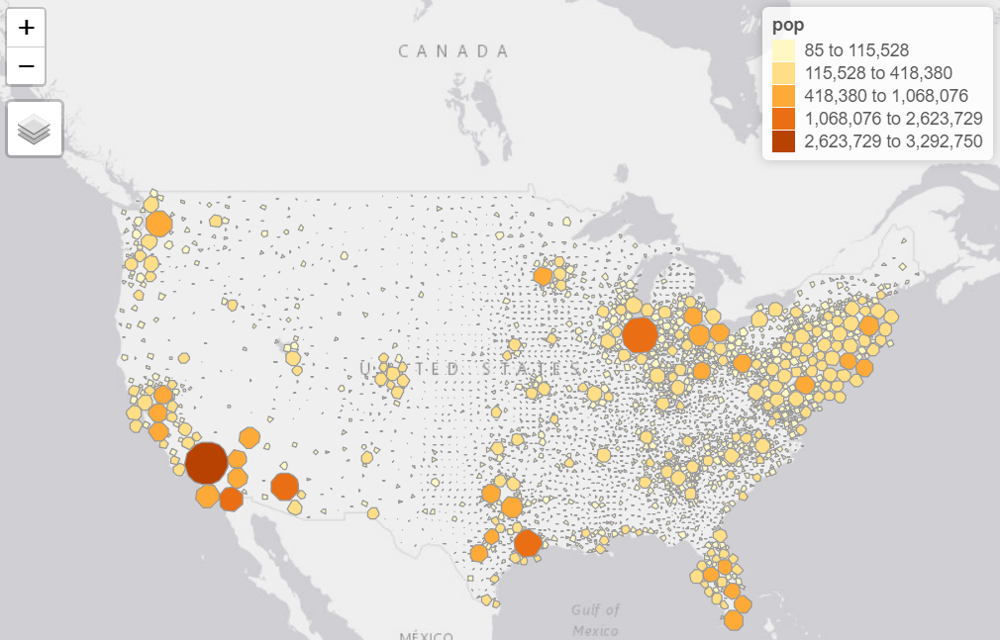
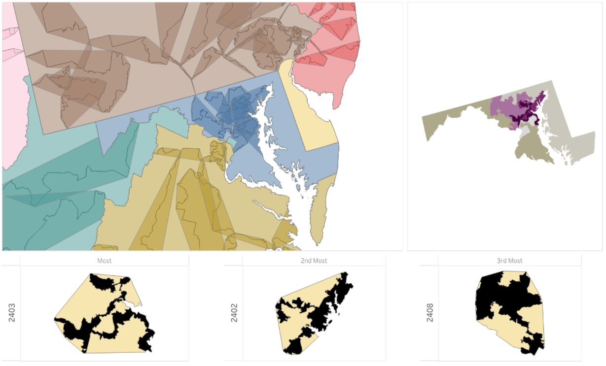
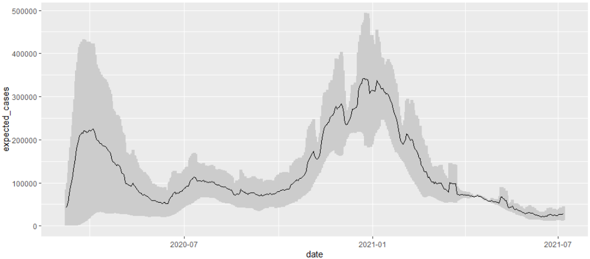
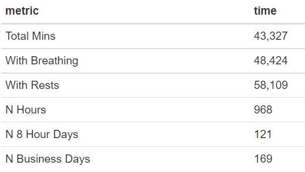
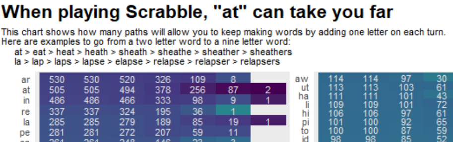
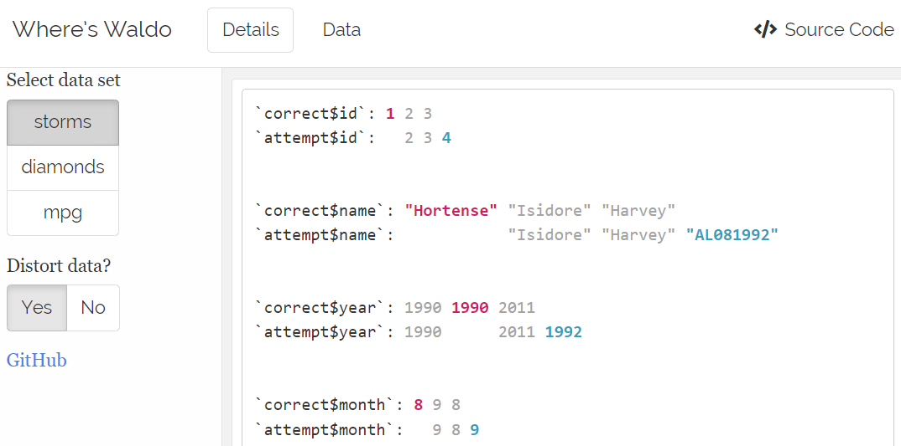

# One-off Projects & Analyses 

    
    
# GIS
* [Dorling Cartogram (packed circles)](R/map-cartogram-dorling)

    &emsp;&emsp;&emsp;&emsp;&emsp;&emsp;
    

* [COVID & Elections]() Has there been a correlation between political party
and infection rates?

* [Drawing wih R](R/drawing-with-r) Given an image (jpg), can R return the graphic as
circles or lines

    &emsp;&emsp;&emsp;&emsp;&emsp;&emsp;;
    

* [Gerrymandering](R/gerrymandering) While there is no great way to identify in an area
is gerrymandered, I looked at concave hulls for congressional districts and the 
overlapping areas shared with other districts. This analysis provides the data for 
[this](https://public.tableau.com/app/profile/jake.riley/viz/Gerrymandering_0/USA) Tableau dashboard

    &emsp;&emsp;&emsp;&emsp;&emsp;&emsp;;
    

# Other
* [COVID confidence intervals]() While the # of cases is subject to testing or 
a person being symptomatic enough to seek medical care, the number of deaths due
to COVID hashigher accuracy. Making some assumptions about the 2% infection 
rate and a 3 week lag between a positive test result and death can we make 
estimates about the true number of cases in the United States? What are the 
confidence intervals?

    &emsp;&emsp;&emsp;&emsp;&emsp;&emsp;
    

* [Counting to 1,000,000](R/count-to-one-million/count-to-1000000.Rmd) How long would it take to count out-loud from 1 to 1 million? (see [html](https://rjake.github.io/one-off-projects/R/count-to-one-million/count-to-one-million.html))

    &emsp;&emsp;&emsp;&emsp;&emsp;&emsp;
    

* [Glasses](R/glasses) This app helps me find frames on [zenni.com](www.zenni.com). The dashboard can be seen 
[here](https://rjake.shinyapps.io/glasses_fit) 

* [Resume](R/resume/resume.pdf) Written with R/LaTeX

    &emsp;&emsp;&emsp;&emsp;&emsp;&emsp;
    

* [Scrabble](R/scrabble) Two questions, what two-letter words are easiest to work with? 'at' and 'la' are a good start. What seven letter word can have 1 letter removed each time to return a single letter? Not something you'd do in scrabble, but the answer to the riddle is planets > planet > plane > lane > lan > la > a)

    &emsp;&emsp;&emsp;&emsp;&emsp;&emsp;
    

* [Text - Sentiment Analysis](R/text-sentiment-analysis) This is a templated script I put together for someone to get started with sentiment analysis. It uses `spacyr` and `reticulate` for some of the lemmanization and part-of-speech tagging (
[overview](R/text-sentiment-analysis/text-analysis.md), 
[script](R/text-sentiment-analysis/diagram-sentences.R)
)

* [Where's Waldo]() A proof-of-concept dashboard using `waldo::compare()` with
and the `fansi` package to mimic the colorful display
R shows in the console.

    &emsp;&emsp;&emsp;&emsp;&emsp;&emsp;
    
