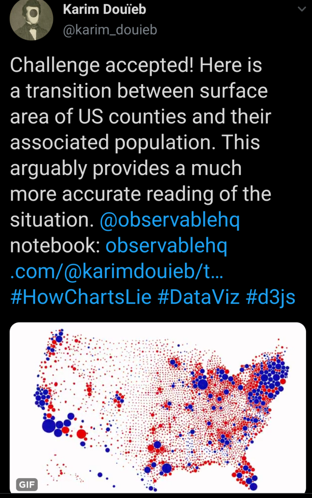

# Dorling Cartogram (packed circles)

Inspired by [this post](https://twitter.com/karim_douieb/status/1181695687005745153):

&nbsp;&nbsp;&nbsp;&nbsp;&nbsp;&nbsp;&nbsp;&nbsp;

I was able to use the [`cartogram`](https://github.com/sjewo/cartogram) package to create what is called a "dorling cartogram"

Here is: 

* the **[code](dorling_cartogram.R)** used to generate the bubbles

* **[Geospatial files](geospatial)** with the circle radius proportional to the population (2015 census) 
    * `Rds` file - `sf` polygons of circles
    * `geojson` files - the circles plus normal state and county polygons. Including these as Alaska & Hawaii moved to the lower left. These come from [`urbnmapr`](https://urbaninstitute.github.io/urbnmapr/articles/introducing-urbnmapr.html)
    * `csv` of circle centroids and population sizes
  
* What it looks like with `ggplot2`

    &nbsp;&nbsp;&nbsp;&nbsp;
    
* And with `tmap`

    &nbsp;&nbsp;&nbsp;&nbsp;

