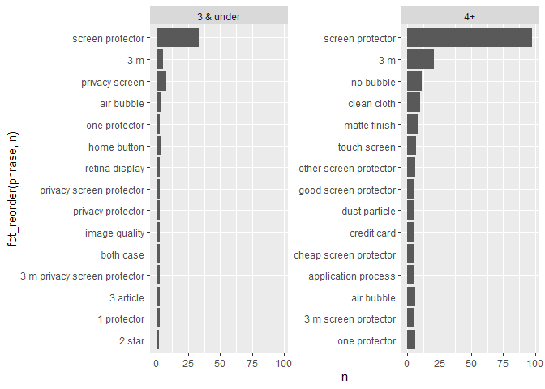
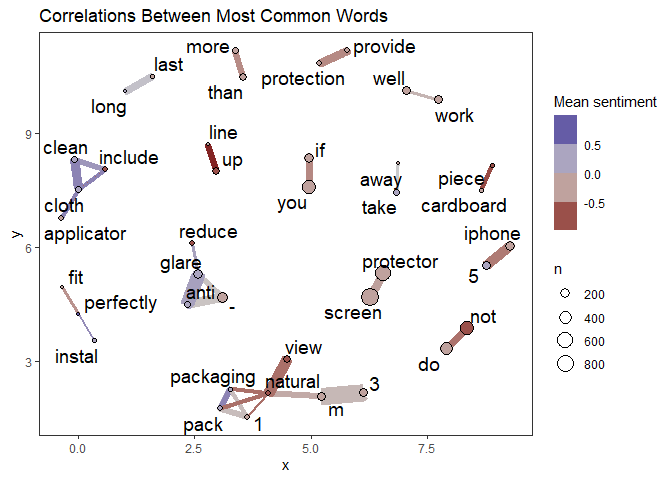

text sentiment analysis
================

## Helpful links

-   `spacyr` tags use Penn Treebank
    [taglist](https://www.ling.upenn.edu/courses/Fall_2003/ling001/penn_treebank_pos.html)
-   [Supervised Machine Learning for Text Analysis in
    R](https://smltar.com/stemming.html#lemmatization)
-   [Text Mining with
    R](https://www.tidytextmining.com/nasa.html#networks-of-keywords)
-   `tidytext`
    [docs](https://juliasilge.github.io/tidytext/articles/tidytext.html)

### Base Data

    ## # A tibble: 248 x 6
    ##    text_id subject   author    date       score text                            
    ##      <int> <chr>     <chr>     <date>     <dbl> <chr>                           
    ##  1       1 B009A51Y~ A220E3KX~ 2012-12-20     4 3m natural view nv827748 screen~
    ##  2       2 B009A51Y~ ASF0R1CM~ 2013-02-17     5 really, all you need in a scree~
    ##  3       3 B009A51Y~ ADLVFFE4~ 2013-02-14     3 3ms is one of the better screen~
    ##  4       4 B009A51Y~ A19UTUEB~ 2013-01-20     5 i took this to my phone store t~
    ##  5       5 B009A51Y~ A3OW12V8~ 2013-01-29     5 this is a great place to start ~
    ##  6       6 B009A51Y~ A2LAS014~ 2013-02-10     3 this screen protector doesn't o~
    ##  7       7 B009A51Y~ A1XO76JV~ 2012-10-24     4 previously with my old iphone 4~
    ##  8       8 B009A51Y~ A2MPXAJK~ 2012-11-15     3 when i got this, there were *no~
    ##  9       9 B009A51Y~ A3T4OHEA~ 2013-01-26     4 i have found that most screen p~
    ## 10      10 B009A51Y~ AIEEK7AH~ 2013-03-02     5 this screen protector does a go~
    ## # ... with 238 more rows

### extract sentences

    ## # A tibble: 1,535 x 8
    ##    text_id subject  author   date       score text                  doc_id nchar
    ##      <int> <chr>    <chr>    <date>     <dbl> <chr>                  <int> <int>
    ##  1       1 B009A51~ A220E3K~ 2012-12-20     4 3m natural view nv82~      1   191
    ##  2       2 B009A51~ ASF0R1C~ 2013-02-17     5 really, all you need~      2   140
    ##  3       2 B009A51~ ASF0R1C~ 2013-02-17     5 the kit also has all~      3   223
    ##  4       2 B009A51~ ASF0R1C~ 2013-02-17     5 it's simple, easy, a~      4    54
    ##  5       2 B009A51~ ASF0R1C~ 2013-02-17     5 i always have troubl~      5   153
    ##  6       2 B009A51~ ASF0R1C~ 2013-02-17     5 so, for mainly that ~      6    85
    ##  7       3 B009A51~ ADLVFFE~ 2013-02-14     3 3ms is one of the be~      7    41
    ##  8       3 B009A51~ ADLVFFE~ 2013-02-14     3 it's almost invisibl~      8   265
    ##  9       3 B009A51~ ADLVFFE~ 2013-02-14     3 unless you can affor~      9   128
    ## 10       3 B009A51~ ADLVFFE~ 2013-02-14     3 and for as long as y~     10    72
    ## # ... with 1,525 more rows

### lemmanization & part of speech tagging with `spacyr::spacy_parse()`

    ## # A tibble: 35,013 x 13
    ##    doc_id sentence_id token_id token   lemma   pos   tag   head_token_id dep_rel
    ##     <int>       <int>    <int> <chr>   <chr>   <chr> <chr>         <dbl> <chr>  
    ##  1      1           1        1 3       3       NUM   CD                2 nummod 
    ##  2      1           1        2 m       m       NOUN  NN                4 nmod   
    ##  3      1           1        3 natural natural ADJ   JJ                4 amod   
    ##  4      1           1        4 view    view    NOUN  NN                4 ROOT   
    ##  5      1           1        5 nv8277~ nv8277~ PROPN NNP               6 compou~
    ##  6      1           1        6 screen  screen  NOUN  NN                7 compou~
    ##  7      1           1        7 protec~ protec~ NOUN  NN                4 appos  
    ##  8      1           1        8 for     for     ADP   IN                7 prep   
    ##  9      1           1        9 iphone  iphone  NOUN  NN               13 nmod   
    ## 10      1           1       10 5       5       NUM   CD               13 nummod 
    ## # ... with 35,003 more rows, and 4 more variables: entity <chr>,
    ## #   nounphrase <chr>, whitespace <lgl>, word <chr>

### Noun-phrases with `spacyr::nounphrase_consolidate()`

    ## # A tibble: 27,567 x 7
    ##    doc_id sentence_id token_id token            lemma            pos     tag    
    ##     <int>       <int>    <dbl> <chr>            <chr>            <chr>   <chr>  
    ##  1      1           1        1 3m_natural_view  3m_natural_view  nounph~ nounph~
    ##  2      1           1        2 nv827748_screen~ nv827748_screen~ nounph~ nounph~
    ##  3      1           1        3 for              for              ADP     IN     
    ##  4      1           1        4 iphone_5_-_1_pa~ iphone_5_-_1_pa~ nounph~ nounph~
    ##  5      1           1        5 3m_natural_view  3m_natural_view  nounph~ nounph~
    ##  6      1           1        6 nv827748_screen~ nv827748_screen~ nounph~ nounph~
    ##  7      1           1        7 for              for              ADP     IN     
    ##  8      1           1        8 iphone_5_-_1_pa~ iphone_5_-_1_pa~ nounph~ nounph~
    ##  9      1           1        9 3m_natural_view  3m_natural_view  nounph~ nounph~
    ## 10      1           1       10 nv827748_screen~ nv827748_screen~ nounph~ nounph~
    ## # ... with 27,557 more rows

    ## # A tibble: 2,396 x 7
    ##    doc_id phrase                  text_id subject   author      date       score
    ##     <int> <chr>                     <int> <chr>     <chr>       <date>     <dbl>
    ##  1      1 3m natural view               1 B009A51Y~ A220E3KXVD~ 2012-12-20     4
    ##  2      1 nv827748 screen protec~       1 B009A51Y~ A220E3KXVD~ 2012-12-20     4
    ##  3      1 iphone 5 - 1 pack             1 B009A51Y~ A220E3KXVD~ 2012-12-20     4
    ##  4      2 ascreen protector             2 B009A51Y~ ASF0R1CMSF~ 2013-02-17     5
    ##  5      2 iphone screen protector       2 B009A51Y~ ASF0R1CMSF~ 2013-02-17     5
    ##  6      3 all thebasic                  2 B009A51Y~ ASF0R1CMSF~ 2013-02-17     5
    ##  7      3 thescreen protector           2 B009A51Y~ ASF0R1CMSF~ 2013-02-17     5
    ##  8      3 3 m screen protector e~       2 B009A51Y~ ASF0R1CMSF~ 2013-02-17     5
    ##  9      3 its application               2 B009A51Y~ ASF0R1CMSF~ 2013-02-17     5
    ## 10      4 no bubble                     2 B009A51Y~ ASF0R1CMSF~ 2013-02-17     5
    ## # ... with 2,386 more rows

<!-- -->

    ## # A tibble: 35,013 x 18
    ##    doc_id sentence_id token_id token   lemma   pos   tag   head_token_id dep_rel
    ##     <int>       <int>    <int> <chr>   <chr>   <chr> <chr>         <dbl> <chr>  
    ##  1      1           1        1 3       3       NUM   CD                2 nummod 
    ##  2      1           1        2 m       m       NOUN  NN                4 nmod   
    ##  3      1           1        3 natural natural ADJ   JJ                4 amod   
    ##  4      1           1        4 view    view    NOUN  NN                4 ROOT   
    ##  5      1           1        5 nv8277~ nv8277~ PROPN NNP               6 compou~
    ##  6      1           1        6 screen  screen  NOUN  NN                7 compou~
    ##  7      1           1        7 protec~ protec~ NOUN  NN                4 appos  
    ##  8      1           1        8 for     for     ADP   IN                7 prep   
    ##  9      1           1        9 iphone  iphone  NOUN  NN               13 nmod   
    ## 10      1           1       10 5       5       NUM   CD               13 nummod 
    ## # ... with 35,003 more rows, and 9 more variables: entity <chr>,
    ## #   nounphrase <chr>, whitespace <lgl>, word <chr>, text_id <int>,
    ## #   subject <chr>, author <chr>, date <date>, score <dbl>

## Sentiment Plots

### Sentiment lexicon [`AFINN`](http://corpustext.com/reference/sentiment_afinn.html)

    ## # A tibble: 10 x 3
    ##    word        sentiment_value sentiment
    ##    <chr>                 <dbl> <chr>    
    ##  1 distressing              -2 negative 
    ##  2 disgrace                 -2 negative 
    ##  3 erroneous                -2 negative 
    ##  4 intense                   1 positive 
    ##  5 goddamn                  -3 negative 
    ##  6 contagion                -2 negative 
    ##  7 craziest                 -2 negative 
    ##  8 fucker                   -4 negative 
    ##  9 unsupported              -2 negative 
    ## 10 defender                  2 positive

    ## # A tibble: 35,013 x 14
    ##    text_id subject  author date       score doc_id phrase_part word  afinn_value
    ##      <int> <chr>    <chr>  <date>     <dbl>  <int>       <int> <chr>       <dbl>
    ##  1       1 B009A51~ A220E~ 2012-12-20     4      1           1 3              NA
    ##  2       1 B009A51~ A220E~ 2012-12-20     4      1           1 m              NA
    ##  3       1 B009A51~ A220E~ 2012-12-20     4      1           1 natu~           1
    ##  4       1 B009A51~ A220E~ 2012-12-20     4      1           1 view           NA
    ##  5       1 B009A51~ A220E~ 2012-12-20     4      1           1 nv82~          NA
    ##  6       1 B009A51~ A220E~ 2012-12-20     4      1           1 scre~          NA
    ##  7       1 B009A51~ A220E~ 2012-12-20     4      1           1 prot~          NA
    ##  8       1 B009A51~ A220E~ 2012-12-20     4      1           1 for            NA
    ##  9       1 B009A51~ A220E~ 2012-12-20     4      1           1 ipho~          NA
    ## 10       1 B009A51~ A220E~ 2012-12-20     4      1           1 5              NA
    ## # ... with 35,003 more rows, and 5 more variables: afinn <chr>, bing <chr>,
    ## #   n <dbl>, sentiment <chr>, sentiment_value <dbl>

<!-- --><!-- --><!-- -->

## Network graph using `ggraph` & `widyr`

    ## # A tibble: 57,360 x 3
    ##    word    word2   correlation
    ##    <chr>   <chr>         <dbl>
    ##  1 m       3             0.794
    ##  2 3       m             0.794
    ##  3 anti    glare         0.666
    ##  4 glare   anti          0.666
    ##  5 view    natural       0.599
    ##  6 natural view          0.599
    ##  7 5       iphone        0.581
    ##  8 iphone  5             0.581
    ##  9 cloth   clean         0.517
    ## 10 clean   cloth         0.517
    ## # ... with 57,350 more rows

<!-- -->
