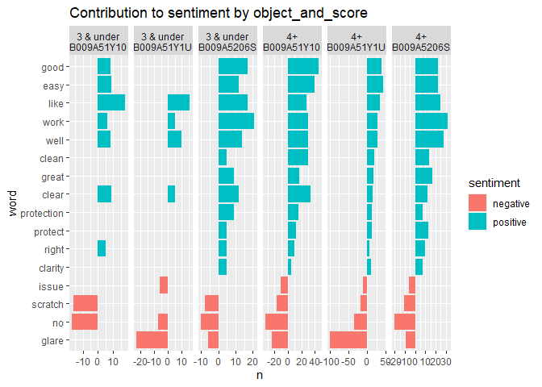

text sentiment analysis
================

## Helpful links

-   `spacyr` tags use Penn Treebank
    [taglist](https://www.ling.upenn.edu/courses/Fall_2003/ling001/penn_treebank_pos.html)
-   [Supervised Machine Learning for Text Analysis in
    R](https://smltar.com/stemming.html#lemmatization)
-   [Text Mining with
    R](https://www.tidytextmining.com/nasa.html#networks-of-keywords)
-   `tidytext`
    [docs](https://juliasilge.github.io/tidytext/articles/tidytext.html)

## Data

### Raw data

    ## # A tibble: 6 x 6
    ##   text_id object_id  author_id   date       rating text                         
    ##     <int> <chr>      <chr>       <date>      <dbl> <chr>                        
    ## 1       1 B009A51Y10 A220E3KXVD~ 2012-12-20      4 "3M Natural View NV827748 Sc~
    ## 2       2 B009A51Y10 ASF0R1CMSF~ 2013-02-17      5 "Really, all you need in a s~
    ## 3       3 B009A51Y10 ADLVFFE4VB~ 2013-02-14      3 "3Ms is one of the better sc~
    ## 4       4 B009A51Y10 A19UTUEBWK~ 2013-01-20      5 "I took this to my phone sto~
    ## 5       5 B009A51Y10 A3OW12V8O7~ 2013-01-29      5 "This is a great place to st~
    ## 6       6 B009A51Y10 A2LAS014NS~ 2013-02-10      3 "This screen protector doesn~

### Extract sentences

    ## # A tibble: 6 x 8
    ##   text_id object_id  author_id date       rating text            phrase_id nchar
    ##     <int> <chr>      <chr>     <date>      <dbl> <chr>               <int> <int>
    ## 1       1 B009A51Y10 A220E3KX~ 2012-12-20      4 3M Natural Vie~         1   191
    ## 2       2 B009A51Y10 ASF0R1CM~ 2013-02-17      5 Really, all yo~         2   140
    ## 3       2 B009A51Y10 ASF0R1CM~ 2013-02-17      5 The kit also h~         3   157
    ## 4       2 B009A51Y10 ASF0R1CM~ 2013-02-17      5 Where this 3M ~         4    65
    ## 5       2 B009A51Y10 ASF0R1CM~ 2013-02-17      5 It's simple, e~         5    54
    ## 6       2 B009A51Y10 ASF0R1CM~ 2013-02-17      5 I always have ~         6   153

### `spacyr` lemmanization & part of speech tagging

    ## # A tibble: 10 x 13
    ##    doc_id sentence_id token_id token   lemma   pos   tag   head_token_id dep_rel
    ##    <chr>        <int>    <int> <chr>   <chr>   <chr> <chr>         <dbl> <chr>  
    ##  1 1                1        1 3       3       NUM   CD                7 nummod 
    ##  2 1                1        2 M       M       PROPN NNP               7 compou~
    ##  3 1                1        3 Natural Natural PROPN NNP               4 compou~
    ##  4 1                1        4 View    View    PROPN NNP               7 compou~
    ##  5 1                1        5 NV8277~ NV8277~ PROPN NNP               7 compou~
    ##  6 1                1        6 Screen  Screen  PROPN NNP               7 compou~
    ##  7 1                1        7 Protec~ Protec~ PROPN NNP               7 ROOT   
    ##  8 1                1        8 for     for     ADP   IN                7 prep   
    ##  9 1                1        9 iPhone  iPhone  PROPN NNP               8 pobj   
    ## 10 1                1       10 5       5       NUM   CD               20 nummod 
    ## # ... with 4 more variables: entity <chr>, nounphrase <chr>, whitespace <lgl>,
    ## #   word <chr>

### Noun-phrases

### `spacyr::nounphrase_consolidate`

    ##               lemma  n
    ## 1  screen_protector 69
    ## 2               3_M 23
    ## 3    protect_screen 14
    ## 4       make_screen 13
    ## 5         no_bubble 11
    ## 6      clean_screen 10
    ## 7        see_screen 10
    ## 8         use_phone 10
    ## 9        air_bubble  9
    ## 10              3_m  8

### `spacyr::nounphrase_extract`

    ##            nounphrase n
    ## 1   screen_protectors 7
    ## 2                 3_m 6
    ## 3          no_bubbles 6
    ## 4        any_problems 4
    ## 5         1_protector 3
    ## 6             3_items 3
    ## 7            any_kind 3
    ## 8  diminished_clarity 3
    ## 9      frequent_drops 3
    ## 10      glare_concern 3

## Sentiment Plots

### Sentiment lexicon [`AFINN`](http://corpustext.com/reference/sentiment_afinn.html)

    ## # A tibble: 6 x 3
    ##   word       sentiment_value sentiment
    ##   <chr>                <dbl> <chr>    
    ## 1 abandon                 -2 negative 
    ## 2 abandoned               -2 negative 
    ## 3 abandons                -2 negative 
    ## 4 abducted                -2 negative 
    ## 5 abduction               -2 negative 
    ## 6 abductions              -2 negative

<!-- --><!-- --><!-- -->

<!-- --><!-- -->

## Network graph using `ggraph` & `widyr`

<!-- -->
